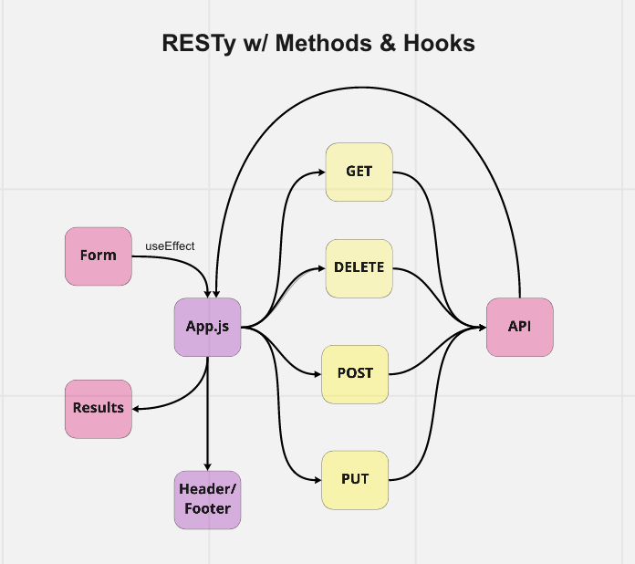
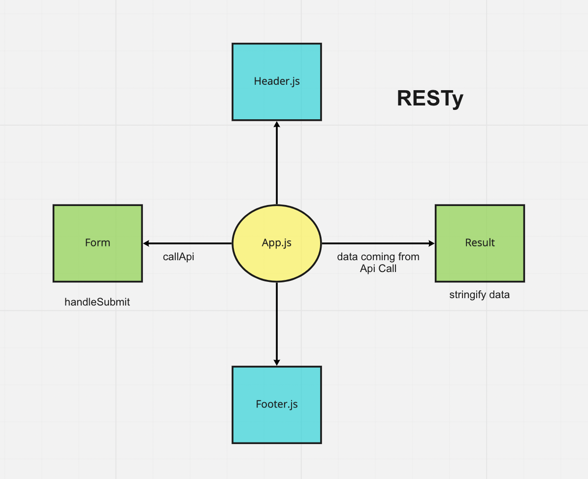

# RESTy

Created by Harvey Lucas and Roop Hayer

## Deploy URL's

Netlify: https://cocky-albattani-48a932.netlify.app/

Actions: https://github.com/tripppdx/resty/actions

PR: https://github.com/tripppdx/resty/pull/4

## Summary of Problem Domain

A browser based API testing tool

Our application will be an API testing tool that can be run in any browser, allowing a user to easily interact with APIs in a familiar interface.

- The following user stories detail the major functionality for this phase of the project.

  - As a user, I want to enter the REST Method and URL to an API
  - As a user, I want to see a summary of my request as well as results returned from an API request in my browser in a readable format

- Application Flow:

  - User enters an API URL
  - Chooses a REST Method
  - Clicks the “Go” button
  - Application fetches data from the URL given, with the method specified
  - Displays the response headers and results separately
  - Both headers and results should be “pretty printed” JSON

### Phase 3 Requirements - Lab Class 28

In phase 3, we will be connecting RESTy to live APIs, fetching and displaying remote data. Our primary focus will be to service GET requests

### Phase 2 Requirements - Lab: Class 27

In phase 2, we will be receiving user input in preparation of connecting to live APIs, using the useState() hook in our functional components

### Phase 1 Requirements - Lab: Class 26

Refactor the RESTy application as follows:

1. Convert all child components of App.js from classes to functions

- The App component serves as the container for all sub-components of this application.
- Leave this component as a Class.
- Make sure all base styles for App are included in a .scss imported within App.js.
- Ensure that the Header, Footer, Results and Form components are imported using ES6 import syntax.

2. Use .scss files to style each component

- Each of the components use their own .scss file for styling.

3. Core application functionality should remain unchanged:

- The Form component should:
  - Call a function on submit that updates the App component via a function sent down as a prop so that the app can process the form values.
- The Results component should show mock API results.

## Visual

